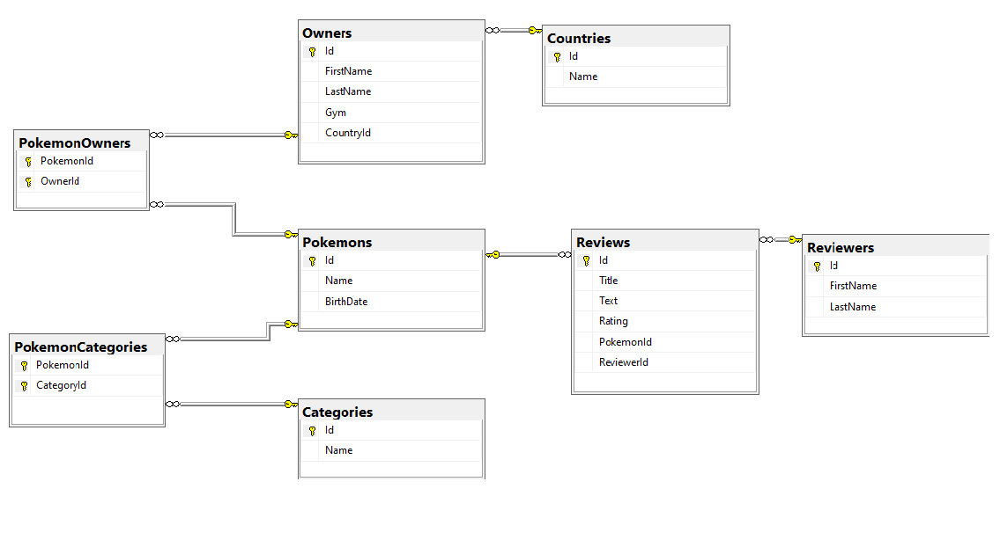

# ReviewApp

ReviewApp is an application for managing Pokémon reviews. It is built with ASP.NET Core and uses Entity Framework Core for database management.

## Table of Contents

- [ReviewApp](#reviewapp)
  - [Table of Contents](#table-of-contents)
  - [Features](#features)
  - [System Requirements](#system-requirements)
  - [Installation](#installation)
  - [Configuration](#configuration)
  - [Database Migration and Seeding](#database-migration-and-seeding)
  - [Running the Application](#running-the-application)
  - [Using Swagger](#using-swagger)
  - [Database Schema](#database-schema)
  - [Troubleshooting](#troubleshooting)

## Features

- Manage Pokémon information
- Manage Pokémon reviews
- Manage Pokémon owners and categories

## System Requirements

- .NET 6 SDK or later
- SQL Server (local or remote)

## Installation

1. **Clone the repository:**

   ```sh
   git clone https://github.com/TienDorothy/api-asp.net-v1-review-app.git
   cd api-asp.net-v1-review-app/
   ```

2. **Install the required packages:**

   ```sh
   dotnet restore
   ```

## Configuration

1. **Update `appsettings.json` with your SQL Server connection string:**

   ```json
   {
     "ConnectionStrings": {
       "DefaultConnection": "Your SQL Server connection string here"
     }
   }
   ```

2. **Add the database context to the service container in `Program.cs`:**

   ```csharp
   builder.Services.AddDbContext<DataContext>(options =>
   {
       options.UseSqlServer(builder.Configuration.GetConnectionString("DefaultConnection"));
   });
   ```

## Database Migration and Seeding

1. **Add a migration to set up the database schema:**

   ```sh
   dotnet ef migrations add InitialCreate
   ```

2. **Apply the migration to create the database:**

   ```sh
   dotnet ef database update
   ```

3. **Add database with initial data (optional):**

If you want to add a template database, you can use `template.sql`. Run the following command to import the SQL file into your SQL Server:

## Running the Application

1. **Run the application:**

   ```sh
   dotnet run
   ```

2. **Open your browser and navigate to:**

   ```
   https://localhost:5230/api/{endpoint}
   ```

## Using Swagger

**Explore the API endpoints** and test them using Swagger UI.

- [Link Swagger UI](https://localhost:5230/swagger/index.html)

## Database Schema

Here is the Entity-Relationship Diagram (ERD) for the database schema:



## Troubleshooting

If you encounter issues, consider the following steps:

1. **Check your database connection string** in `appsettings.json`.
2. **Ensure you have the correct version of .NET SDK** installed.
3. **Check if the database context is correctly configured** in `Program.cs`.
